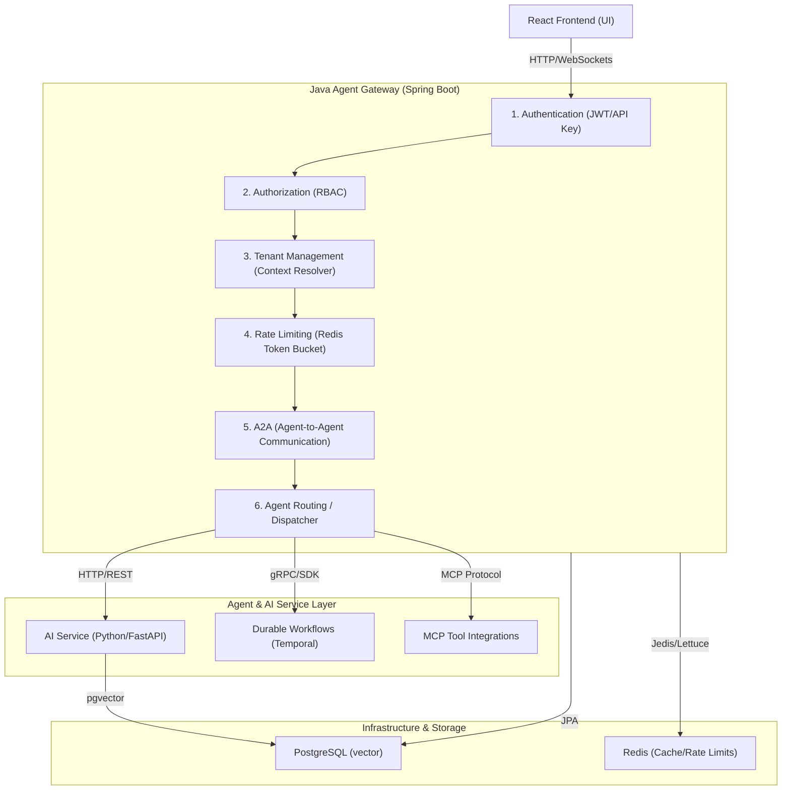

# Enterprise AgentOps Platform Architecture

This document describes the high-level architecture of the Enterprise AgentOps Platform, focusing on the flow from the user interface down to agent execution and orchestration.

## Architecture Topology

---

## 1. Authentication & Security
- **JWT Authentication**: Validates tokens issued by identity providers (e.g., Keycloak, Cognito, or a local service).
- **API Keys**: Extends access to external systems or integrations, resolving key ownership to a tenant and service context.

## 2. Authorization (RBAC)
- **Roles**: Defines scopes like `admin`, `developer`, `operator`, and `viewer`.
- **Permissions**: Access constraints at resource levels (`incident:create`, `agent:invoke`, `document:write`).

## 3. Tenant Management
- **Multi-Tenancy**: Resolves the tenant context (e.g. from subdomains, headers like `X-Tenant-ID`, or JWT claims).
- **Isolation**: Ensures all DB connections, cache keys, and execution logs are partitioned by the resolved `tenant_id`.

## 4. Rate Limiting
- **Redis-Backed Token Bucket**: Implements per-tenant and per-user rate limits to prevent runaway loops (e.g., infinite agent recursive invocations).

## 5. Agent-to-Agent (A2A) Communication
- **Mailbox Pattern**: Provides asynchronous messaging between agents.
- **Event Mesh**: Manages reliable delivery of messages using Redis Pub/Sub or transactional outbox.

## 6. Agent Routing & Tool Dispatching
- **Intelligent Dispatch**: Dynamically routes task executions to the `FastAPI AI Service` or background `Temporal` workflows.
- **Model Context Protocol (MCP)**: Acts as the client orchestrating external tool invocation safely.
