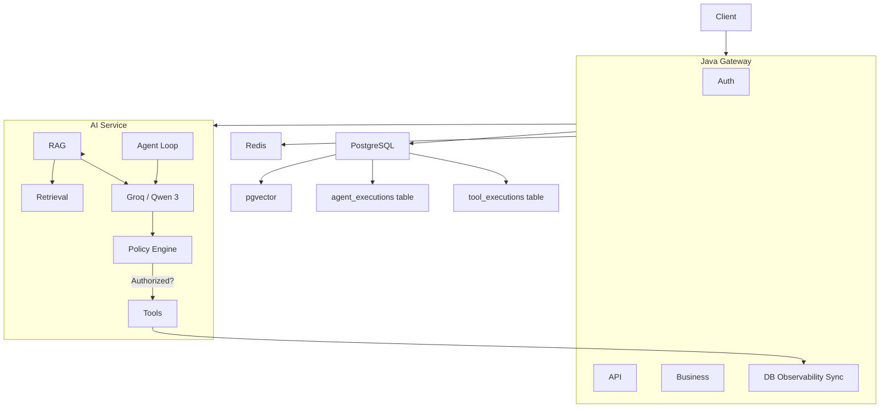

# Enterprise AgentOps Platform Architecture

This document describes the high-level architecture of the Enterprise AgentOps Platform, focusing on the flow from the client through the Java API Gateway to the backend storage and the Python AI services.

## Architecture Topology



---

## 1. Authentication & Security
- **JWT Authentication**: Validates tokens issued by identity providers (e.g., Keycloak, Cognito, or a local service).
- **API Keys**: Extends access to external systems or integrations, resolving key ownership to a tenant and service context.

## 2. Authorization (RBAC)
- **Roles**: Defines scopes like `admin`, `developer`, `operator`, and `viewer`.
- **Permissions**: Access constraints at resource levels (`incident:create`, `agent:invoke`, `document:write`).

## 3. Tenant Management
- **Multi-Tenancy**: Resolves the tenant context (e.g. from subdomains, headers like `X-Tenant-ID`, or JWT claims).
- **Isolation**: Ensures all DB connections, cache keys, and execution logs are partitioned by the resolved `tenant_id`.

## 4. Rate Limiting
- **Redis-Backed Token Bucket**: Implements per-tenant and per-user rate limits to prevent runaway loops (e.g., infinite agent recursive loops).

## 5. Agent-to-Agent (A2A) Communication
- **Mailbox Pattern**: Provides asynchronous messaging between agents.
- **Event Mesh**: Manages reliable delivery of messages using Redis Pub/Sub or transactional outbox.

## 6. Agent Routing & Tool Dispatching
- **Intelligent Dispatch**: Dynamically routes task executions to the `FastAPI AI Service` or background `Temporal` workflows.
- **Model Context Protocol (MCP)**: Acts as the client orchestrating external tool invocation safely.

## 7. Observability & Auditing
- **Agent Executions**: Evaluates agent session health, token usage (input/output tokens), execution duration, and failure messages via the `agent_executions` table.
- **Tool Executions**: Logs every single tool execution (JSON input and JSON output payload, timestamps, status) via the `tool_executions` table.
- **Data Persistence**: Handled natively by the Java gateway using Hibernate `@JdbcTypeCode(SqlTypes.JSON)` to map PostgreSQL `JSONB` columns without type conflicts.

## 8. Guardrails & Policy Engine
- **Tool Policy Gate**: All tools invoke the policy engine ([`policy.py`](file:///c:/Users/sam08/OneDrive/Desktop/interview/90%20days/enterprise-agentops/enterprise-agentops/services/ai-service/app/tools/policy.py)) first.
- **Read-Only vs Action**: Read-only tools (`get_incident`, `get_logs`, `get_metrics`, `get_recent_deployment`) are allowed by default, whereas state-modifying actions are blocked until authorized.

---

## AI Service / Agent Invocation Flow

This diagram illustrates the step-by-step tool selection, policy checks, and reasoning execution path inside the Python AI Service.

```mermaid
sequenceDiagram
    autonumber
    actor Client
    participant JavaGateway as Java Gateway (Port 8080)
    participant AIService as FastAPI AI Service (Port 8081)
    participant Groq as Groq (Qwen 3.8 27B)
    database PostgreSQL

    Client->>JavaGateway: POST /api/v1/agent/investigate (incidentId)
    JavaGateway->>PostgreSQL: Create AgentExecution (Status: RUNNING)
    JavaGateway->>AIService: POST /api/v1/agent/investigate (incident_id)
    
    loop Agent Execution Loop
        AIService->>Groq: chat.completions.create (messages, tools)
        Groq-->>AIService: return finish_reason (tool_calls)
        
        loop For each tool_call
            AIService->>AIService: authorize_tool(tool_name)
            alt Authorized (Read-Only)
                AIService->>AIService: Execute python tool (get_incident/logs/etc.)
            else Blocked (Action)
                AIService-->>AIService: Return security block message
            end
        end
        
        AIService->>Groq: send tool_results back to chat history
    end

    Groq-->>AIService: return finish_reason (stop) + JSON RCA
    AIService-->>JavaGateway: return AgentRcaResponse (JSON + tool_executions)
    
    JavaGateway->>PostgreSQL: Save tool_executions list (JSONB input/output)
    JavaGateway->>PostgreSQL: Update AgentExecution (Status: SUCCESS, input/output tokens)
    JavaGateway-->>Client: return structured RCA response
```
