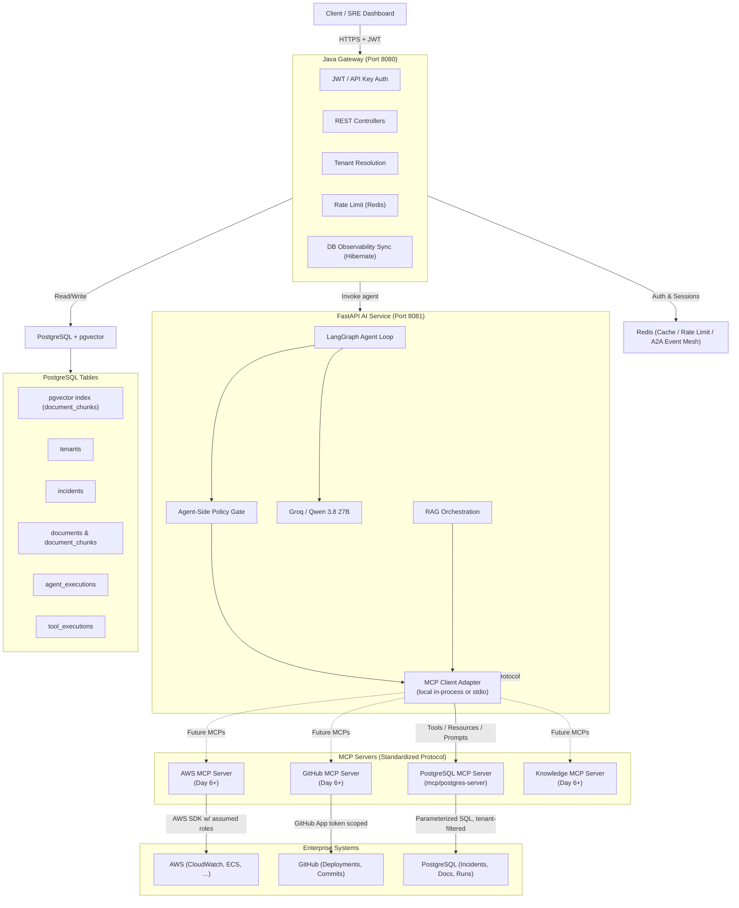
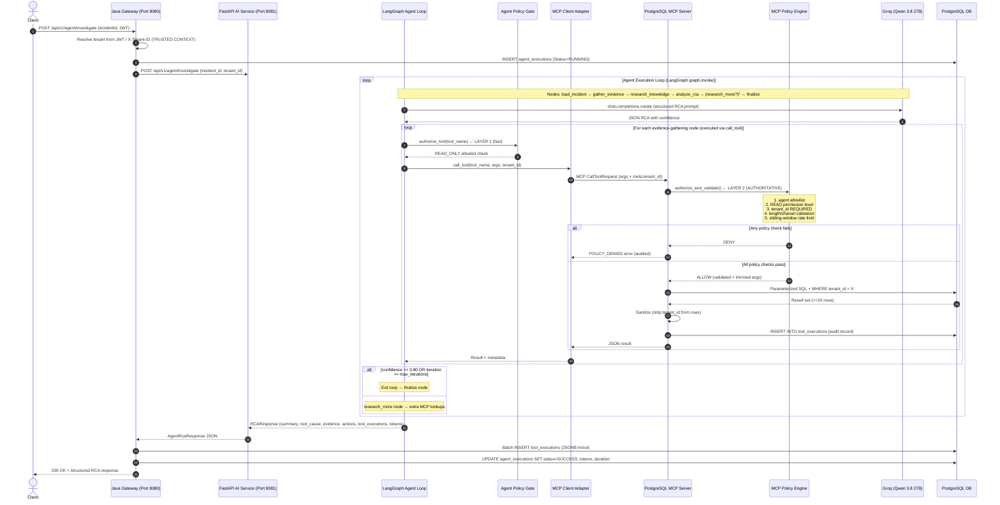

# Enterprise AgentOps Platform Architecture

This document describes the high-level architecture of the Enterprise AgentOps Platform,
focusing on the flow from the client through the Java API Gateway to the backend storage,
the Python AI services, and the **Model Context Protocol (MCP)** servers that standardize
all data and tool access.

---

## Architecture Topology (Post-Day 5)



---

## 0. MCP vs A2A — Core Distinction (Interview Critical)

| Protocol | Focus | Communication Pattern | Examples |
|----------|-------|----------------------|----------|
| **MCP** (Model Context Protocol) | **Agent → Tool/Data** | Request/Response between an agent *consumer* and a capability *server* (tools, resources, prompts) | Agent → PostgreSQL, Agent → AWS CloudWatch, Agent → GitHub, Agent → Filesystem |
| **A2A** (Agent-to-Agent Protocol) | **Agent → Agent** | Conversational / task handoff between *peer agents* | RCA Agent → Security Agent, Research Agent → RCA Agent, External Agent → Internal Agent |

```
                     ┌────────────┐
                     │   Agent    │
                     └─┬────────┬─┘
                       │        │
                    MCP        A2A
                       │        │
                 ┌─────▼──┐  ┌──▼────────┐
                 │  Tools │  │  Agents   │
                 │  Data  │  │  (peers)  │
                 └─────────┘  └───────────┘
```

The A2A specification explicitly describes MCP and A2A as **complementary**:
MCP standardizes how agents *use tools and access data*;
A2A standardizes how agents *collaborate with other agents*.

---

## 1. Authentication & Security
- **JWT Authentication**: Validates tokens issued by identity providers (Keycloak, Cognito, or a local service).
- **API Keys**: Extends access to external systems or integrations, resolving key ownership to a *tenant + service* context.
- **Trusted Security Context**: The resolved `tenant_id` propagates through the Java Gateway → AI Service → MCP Client. **The LLM is never allowed to choose a `tenant_id`.** The MCP server's policy engine rejects any attempt to read another tenant's data.

---

## 2. Authorization (RBAC)
- **Roles**: `admin`, `developer`, `operator`, `viewer`.
- **Permissions**: Resource-level constraints (`incident:create`, `agent:invoke`, `document:write`).
- **Tool Permission Levels** (enforced inside the **MCP server** policy engine, not just the agent):
  - `READ` — always permitted (default Day 5 tools)
  - `WRITE` — requires elevated scope
  - `HIGH_RISK` — explicit human approval before execution (`close_incident`, `rollback`)
  - `CRITICAL` — dual-control approval + change ticket (`emergency_db_failover`)

---

## 3. Tenant Management
- **Multi-Tenancy**: Resolves the tenant context from subdomains, headers (`X-Tenant-ID`), or JWT claims.
- **Isolation at Every Layer**:
  1. Java Gateway tenant-resolver sets the initial trusted context
  2. Agent state carries `tenant_id` — **not modifiable by the LLM**
  3. MCP client passes `tenant_id` in the **MCP `meta` security context**
  4. MCP server policy engine **rejects** any request missing a `tenant_id`
  5. Every SQL query includes `WHERE tenant_id = <trusted_id>` or a join on `tenants.name`
  6. Results are **sanitized** — internal `tenant_id` columns are stripped from the LLM-facing payload

---

## 4. Rate Limiting (Two Layers)

| Layer | Implementation | Purpose |
|-------|----------------|---------|
| Gateway | Redis-backed token bucket (per tenant, per user) | Prevents abuse at the HTTP boundary |
| **MCP Server** (Day 5) | In-memory sliding window per `(tool, tenant)` pair | Stops *runaway agent loops* before they hit the DB or cloud APIs — e.g. `search_incidents` = 20 req/min, `get_incident` = 60 req/min |

Both layers exist because even a well-meaning LLM can accidentally enter a tool-calling loop that racks up enormous costs.

---

## 5. Agent-to-Agent (A2A) Communication
- **Mailbox Pattern**: Asynchronous messaging between agents.
- **Event Mesh**: Redis Pub/Sub or transactional outbox for reliable delivery.
- A2A and MCP are **not competing**: A RCA Agent will still use *MCP* to reach AWS and PostgreSQL while simultaneously speaking *A2A* to request work from a Security Agent peer.

---

## 6. Agent Routing & Tool Dispatching (Post-Day 5)
- **Intelligent Dispatch**: Routes tasks synchronously to FastAPI AI Service or asynchronously to Temporal for long-running workflows.
- **MCP is the Universal Boundary**: The AI Service no longer owns database adapters, AWS SDKs, or GitHub clients. Every non-trivial capability flows through an MCP server.
  - Day 5: PostgreSQL MCP server
  - Day 6+: AWS MCP, GitHub MCP, Knowledge MCP

---

## 7. Observability & Auditing
- **Agent Executions**: Agent session health, token usage (input/output), duration, failure messages → `agent_executions` table.
- **Tool Executions**: Every single tool call writes a record with JSON input/output, status, and duration → `tool_executions` table.
  - Written **twice** for MCP tools: once by the MCP server at execution time, again in aggregated form by the Java gateway from the response payload.
  - Later: OpenTelemetry distributed traces will correlate the same operation end-to-end.
- **Persistence**: Java gateway uses Hibernate `@JdbcTypeCode(SqlTypes.JSON)` ↔ PostgreSQL `JSONB`.

---

## 8. Guardrails & Policy Engine — Two-Layer Architecture

```
                         LLM Reasoning
                              │
                              ▼
                   ┌ LangGraph Agent ┐
                   │  (orchestration)│
                   └───────┬─────────┘
                           │
               ┌───────────▼───────────┐
               │ Agent-Side Policy Gate│  ← app/tools/policy.py
               │  (allowlist, fast-fail)│
               └───────────┬───────────┘
                           │
                           ▼
                  ┌──────────────┐
                  │  MCP Client  │  ← app/mcp_client.py
                  │  (transport) │
                  └──────┬───────┘
                         │ MCP protocol
                         ▼
              ┌────────────────────────┐
              │   MCP Policy Engine    │  ← mcp/postgres-server/policy.py
              │                        │
              │  1. Agent allowlist    │
              │  2. Permission level   │   READ / WRITE / HIGH_RISK / CRITICAL
              │  3. Tenant validation  │   ← FROM TRUSTED CONTEXT, NOT THE LLM
              │  4. Input validation   │   lengths / charsets / ranges
              │  5. Rate limits        │   per (tool, tenant)
              │  6. Result caps        │   max 20 rows
              └───────────┬────────────┘
                          │
                     ALLOW│DENY
                          ▼
                   Database / AWS / GitHub
```

- **Layer 1 (Fast, agent-side)**: [`app/tools/policy.py`](services/ai-service/app/tools/policy.py) — in-memory `READ_ONLY_TOOLS` allowlist. Instantly blocks unknown tools.
- **Layer 2 (Authoritative, MCP server-side)**: [`mcp/postgres-server/policy.py`](mcp/postgres-server/policy.py) — **the real security boundary**. Handles per-tenant auth, fine-grained permission levels, sliding-window rate limits, strict parameter validation, and audit logging. Even a compromised or misconfigured agent cannot bypass these checks because they occur *inside the server that owns the data*.

---

## 9. MCP Primitives — Implemented on Day 5

Every MCP server can expose three standardized primitives. **PostgreSQL MCP implements all three.**

### 9.1 Tools — "Do something"
Actions the agent requests. Input schemas, descriptions, and behavior are
**negotiated at runtime** via the MCP protocol. No arbitrary SQL is exposed.

| Tool | Permission | Rate Limit | Purpose |
|------|------------|------------|---------|
| `get_incident(incident_id)` | READ | 60/min | Retrieve a single incident record by ID |
| `search_incidents(query, limit)` | READ | 20/min | Keyword search across active and historical incidents |
| `get_incident_history(service, limit)` | READ | 30/min | All incidents for a specific service (recurring-pattern analysis) |
| `search_documents(query, limit)` | READ | 20/min | Search runbooks, architecture docs, postmortems |
| `get_document(document_id)` | READ | 60/min | Fetch full document body by ID or source path |

**Design principle:** constrained operations over omnibus "execute SQL" endpoints.
`search_incidents()` over `execute_any_sql("SELECT * FROM …")`
→ least privilege, auditable, rate-limited.

### 9.2 Resources — "Give me this information"
Read-only contextual data identified by a URI. Conceptually different from tools
because resources are *passive information*, not *requested actions*.

| URI | Content |
|-----|---------|
| `runbooks://{service}` | Full operational runbook for a given service (symptoms → triage → rollback) |
| `incidents://{incident_id}` | Markdown-formatted incident summary |

Resources allow the agent to *quickly load* reference material without a tool-calling round-trip.

### 9.3 Prompts — "Use this standardized template"
Reusable prompt templates *shipped by the MCP server*. Guarantees every agent
approaches standardized tasks consistently.

| Prompt Name | Purpose |
|-------------|---------|
| `incident-investigation` | 5-section RCA protocol: load runbooks → gather logs/metrics/deploys/history → cross-reference runbooks → structured JSON output → confidence rubric |
| `document-dive` | Deep research protocol: multi-query variants → full-document reads vs snippets → cross-reference synthesis |

---

## 10. PostgreSQL Schema

Defined in [`infrastructure/schema.sql`](infrastructure/schema.sql):

```
PostgreSQL
├── tenants                        (UUID PK, multi-tenant root)
├── incidents                      (tenant_id FK, title, severity, status, created_at)
├── documents                      (tenant_id FK, runbooks / architecture / postmortems)
├── document_chunks                (document_id FK, 1536-dim pgvector embedding)
├── agent_executions               (session-level RCA metadata + tokens + cost)
└── tool_executions                (every MCP + non-MCP tool call, JSONB in/out)
```

Indexes:
- Incidents: `(tenant_id)`, `(status)`, `(created_at DESC)`
- Document chunks: `(document_id)`, ivfflat on embedding with `vector_cosine_ops`

---

## AI Service / Agent Invocation Flow (Post-Day 5)

End-to-end sequence including the new **MCP server hop** and **dual policy gate**.



---

## Roadmap

| Phase | Milestone | Status |
|-------|-----------|--------|
| Day 1 | Project skeleton, docker-compose, PostgreSQL + pgvector schema (`tenants`, `incidents`, `documents`, `document_chunks`, `agent_executions`, `tool_executions`), Java Gateway scaffolding (Spring Boot + Hibernate JSONB) | ✅ Done |
| Day 2 | Java Gateway REST API: `/api/v1/agent/investigate`, `/api/v1/incidents/*`, Incident/Agent/Tool JPA entities + repositories, JWT/RBAC config, observability tables | ✅ Done |
| **Day 3** | **FastAPI AI service bootstrap, Groq LLM client + mock-mode, LangGraph StateGraph skeleton (load → gather → research → analyze → finalize), LangGraph MemorySaver checkpointer, direct Python tool stubs (`get_incident`, `get_logs`, `get_metrics`, `get_recent_deployment`)** | **✅ Done** |
| **Day 4** | **RAG pipeline (loader → chunker → embeddings → pgvector retriever → hybrid search), `search_knowledge()` tool, agent-side `policy.py` (READ_ONLY_TOOLS allowlist gate), `call_tool()` wrapper with ToolExecutionRecord audit records, RCA prompt templates + structured JSON output parser, `RCAResponse` Pydantic schema with token/cost observability fields, HTTP routers (`/investigate`, `/analyze`, `/rag`, `/health`)** | **✅ Done** |
| **Day 5** | **PostgreSQL MCP server (`mcp/postgres-server`): 5 READ tools, 2 resources, 2 prompt templates; policy engine (agent allowlist, permission levels READ→CRITICAL, trusted tenant_id propagation, sliding-window rate limits, strict input validation, max 20 result caps, SQL parameterization, server-side audit writes); MCP Client Adapter (`app/mcp_client.py`) supporting both local in-process and stdio transport modes; LangGraph nodes rewritten to call MCP; `incident_history` threaded through state + RCA prompt; standalone + end-to-end test suites passing (7 tool calls per RCA, full audit trail)** | **✅ Done** |
| Day 6+ | AWS MCP server (CloudWatch logs, CloudWatch metrics, ECS deployments, IAM assumed-role scoping) | Planned |
| Day 6+ | GitHub MCP server (commits, deployments, PR history, scoped GitHub App tokens) | Planned |
| Day 6+ | Knowledge / Vector MCP server (pgvector hybrid search, per-tenant embeddings namespace, document write-gated on WRITE permission) | Planned |
| Day 6+ | WRITE/HIGH_RISK/CRITICAL MCP tool classes + explicit human-in-the-loop approval gate before execution | Planned |
| Future | A2A: multi-agent collaboration (Supervisor Agent → RCA Agent, Research Agent, Security Agent → Release Agent) using Redis event mesh / mailbox pattern | Planned |
| Future | OpenTelemetry distributed traces spanning Java Gateway → FastAPI → MCP Client → MCP Servers → DB, with correlated `trace_id`s across both `agent_executions` and `tool_executions` | Planned |
| Future | Rate limiting promoted from MCP-server in-memory to Redis for multi-instance MCP horizontal scaling | Planned |
